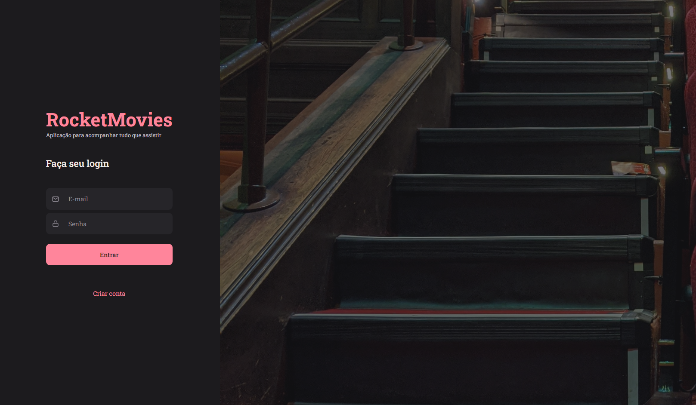

<h1 align="center">MoviesTags</h1>

Project carried out as a challenge for the explorer course, proposing to improve React skills

    <a href="#-tecnologias">Technologies</a>&nbsp;&nbsp;&nbsp;|&nbsp;&nbsp;&nbsp;
    <a href="#-Projeto">Projects</a>&nbsp;&nbsp;&nbsp;|&nbsp;&nbsp;&nbsp;
    <a href="#-Libraries">Libraries</a>&nbsp;&nbsp;&nbsp;|&nbsp;&nbsp;&nbsp;
    <a href="#-licença">licenses</a>

  

  

 

## 🚀 Tecnologias

This project was developed with the following technologies:
- Vite;
- ReactJS;
- styled-components;
- React-router-dom;

## 💻 Projects

application developed without its back-end that will still be applied

## licenses

MIT.